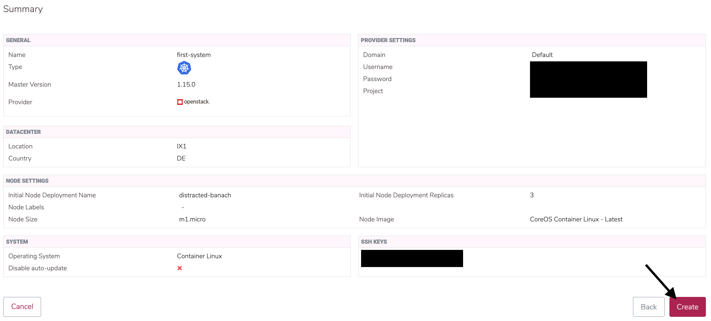

We can create a cluster in iMKE with a couple of clicks.
But before we can do that, we need to create a Project.

To achieve this, we will do the following in iMKE:

* Create a project to manage clusters
* Create a Kubernetes Cluster

We need both the project to manage the resources, and a cluster.
A cluster always belongs to a project, but we can have any number
of projects, even if they don't contain clusters yet.

## Creating a Project

A project is a collection of clusters where users share administrative
access. Projects are only required for management and have no impact
on how you can use the Clusters within.

After logging into iMKE, you will see the following window, where we
need to click on `Add Project`:

This opens a window, where we can give the project a name. In the
example, we use `Team Kubernetes`.
To finish, we click on `Save`.

Now iMKE creates our Project and adds it to the Overview. With a click on
the entry `Team Kubernetes` we enter the project and now we can create
the cluster.

This opens a view showing us the project. We find a list of all existing
clusters and their users, as well as some other controls.

Clicking on the side bar opens the navigation in the Project view, which
allows us to explore the other areas.

## Creating the Cluster

To create the cluster, we click on `Add Cluster` in the top right corner.

This opens the first page of the Cluster Creation procedure. In the example,
we call our Cluster `first-system` and select Kubernetes version 1.15.0:

Then we click `Next` and choose the provider `openstack` and one of the three
availability zones. In this example, we pick `IX1`:

To allow iMKE to request the required resources from OpenStack, we add our
OpenStack credentials now. After that, the contents of `Project` is refreshed
automatically and we can choose the OpenStack project we want to run the cluster
in:

In Node Settings we define how many virtual machines will be available as worker nodes
in the cluster. This node deployment needs a name and a size. For the first cluster 
the name is not super important, so we use the random name generator. We use the
defaults for the number and size of the machines.

We choose Container Linux as the image. Container Linux is designed to run containers
and will automatically be updated by iMKE.

For occassional SSH access, we need to deploy an SSH Key. For this, we click on 
`Add SSH Key`, enter an SSH Public Key, and give it a memorable name:

To finish, we click on `Next`. After we verified all settings, we click on `Create`.

Now the cluster is being created. TO access the information, we return to the Cluster
view of the project and click our Cluster's name.

## Summary

In this guide, we achieved and learnt the following:

* What is an iMKE Project
* How to create an iMKE Project
* What is an iMKE Cluster
* How to configure an iMKE Cluster
* How to start an iMKE Cluster

Congratulations! Now you know how to create a Kubernetes Cluster with iMKE.
The following pages describe cluster usage examples.
