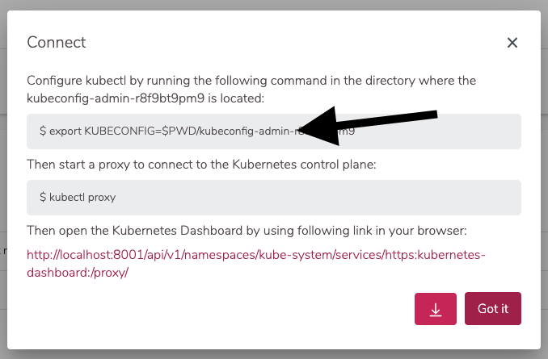

Nachdem wir in iMKE einen Cluster angelegt haben wird
es Zeit, sich mit diesem zu verbinden. Das ist notwendig um
Applikationen zu deployen und zu managen.

*Wichtig: Die folgende Anleitung funktioniert nicht mit einer
kubectl Version unter `1.13`. In diesem Fall bitte erst ein
Update installieren oder alternativ unser Webterminal nutzen!*

## Den Cluster finden

Um einen Cluster zu finden, müssen wir in die Detailansicht
des Clusters gehen.
Hierfür klicken wir auf den Eintrag `first-system`.


## Die Zugangsdaten downloaden

Dann klicken wir rechts oben auf `Connect` und im sich öffnenden
Fenster auf den nach unten gerichteten Pfeil.


Damit laden wir eine Datei herunter, die sich im Kubernetes-Umfeld
`kubeconfig` nennt. In dieser Datei stehen alle Endpunkte,
Zertifikate sowie Bereiche des Clusters. Mit dieser Datei ist
`kubectl`  in der Lage, sich mit dem Cluster zu verbinden.

Um diese Datei zu nutzen, müssen wir sie auf der Konsole
registrieren. Dafür gibt es zwei Möglichkeiten:

1. `kubectl` schaut als Standard in die Datei `.kube/config`
    im Heimat-Verzeichnis des Benutzers.
2. Wir können die `kubeconfig` temporär mittels einer Umgebungsvariable
    exportieren.

Der Einfachheit halber und um auf unserem System die Standards
nicht zu verändern, gehen wir hier mit Variante 2.

Dafür benutzen wir eine Konsole. In den Screenshots verwenden
ich iTerm2 auf macOS, es funktioniert jedoch auf Linux und Windows
bash genau so.

Als erstes müssen wir die herunter geladene Datei finden.
Chrome und Firefox laden diese beide normalerweise in den Downloads
Ordner. Der Dateiname setzt sich jetzt aus zwei Komponenten zusammen:

* `kubeconfig-admin-`
* unserer Cluster ID

Um diese dann zu registrieren nutzen wir folgendes Kommando:

```bash
cd Downloads
export KUBECONFIG=$(pwd)/kubeconfig-admin-CLUSTERID
```

Dieses Kommando finden wir auch einfach im iMKE Webinterface.
In dem Connect Fenster klicken wir hier einfach auf die ausgeschriebene
Version und schon wird dies in unsere Zwischenablage kopiert.


Nun können wir mit unserem Cluster reden. Das einfachste Kommando ist
hier: Zeige mir alle Nodes meines Clusters:

```bash
kubectl get nodes

NAME                           STATUS   ROLES    AGE   VERSION
musing-kalam-XXXXXXXXX-ks4xz   Ready    <none>   10m   v1.15.0
musing-kalam-XXXXXXXXX-txc4w   Ready    <none>   10m   v1.15.0
musing-kalam-XXXXXXXXX-vc4g2   Ready    <none>   10m   v1.15.0
```

## Kubernetes Dashboard

In iMKE starten wir zudem per Default auch das Kubernetes Dashboard.
Um dieses im Browser zu öffnen muss erst ein Tunnel zu der API von
unserem Cluster aufgebaut werden. Hierfür nutzen wir wieder `kubectl`.

```bash
kubectl proxy
```

Dies öffnet bei uns auf localhost:8001 nun einen Port über den wir mit
der Kubernetes API reden können. Über diesen Tunnel kommen wir zudem
auch auf das Dashboard. Einfach folgende URL im Browser öffnen:
[http://localhost:8001/api/v1/namespaces/kube-system/services/https:kubernetes-dashboard:/proxy/](http://localhost:8001/api/v1/namespaces/kube-system/services/https:kubernetes-dashboard:/proxy/)


Beim Login lassen wir `Kubeconfig` ausgewaählt und bei
`Choose kubeconfig file` wählen wir die in den vorherigen
Schritten herunter geladene Datei. Dann klicken wir auf `SIGN IN`.


Nun sehen wir das Kubernetes Dashboard und können
 unseren Cluster grafisch erkunden.


Wenn wir damit fertig sind, stoppen wir die Verbindung mit dem Cluster
wieder durch Drücken von `Control-c`

## Zusammenfassung

Folgende Schritte wurden erfolgreich durchgeführt und gelernt:

* Wie komme ich an meine `kubectl` Konfiguration
* Wie konfiguriere ich `kubectl` auf meinem Computer
* Wie verbinde ich mich mit dem Kubernetes Dashboard

Herzlichen Glückwunsch! Dies sind alle notwendigen Schritte, um sich
mit einem Kubernetes Cluster zu verbinden.
