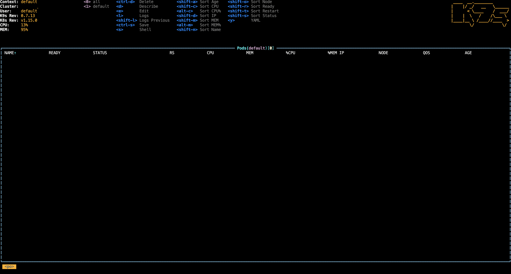

Das iMKE Web Terminal erlaubt die Administration von
Kubernetes Clustern in der Cloud. Benötigt wird lediglich
ein Browser. Da hier eine Shell über den Browser umgeleitet
wird fällt auch ein offener Port `22` für SSH weg.

Das Web Terminal wird bei jedem Neustart resetted. Auf dem
Dateisystem wird nichts behalten und auch nachträglich installierte
Software muss für jede Session neu installiert werden.

## Verbinden

Um sich mit dem Web Terminal zu verbinden gehen wir in iMKE in den Cluster.


Dort klicken wir nun auf `Open Web Terminal`.


Im folgenden wird das Web Terminal gestartet. Dies kann bis zu zwei Minuten
dauern.


Sobald dies fertig ist können wir mit einem Klick auf `Open Web Terminal` das
Web Terminal öffnen.


## Funktionen

Das Web Terminal ist eine voll funktionale Linux Shell. Als Basis wird zsh
verwendet.

Um die Administration von Kubernetes so einfach wie möglich zu machen
sind einige praktische Tools bereits vorinstalliert. Welche dies sind
können wir über das Kommando `help` anzeigen lassen. Dies wird zusätzlich
bei jedem Start des Web Terminals ausgegeben.

```bash
Welcome to iMKE
iNNOVO Managed Kubernetes Engine

You can find the documentation at https://docs.imke.cloud/

Available Kubernetes commands and tools:
kubectl ........... The Kubernetes cli version of a swiss army knife
kustomize ......... Kubernetes native configuration management
helm .............. The Kubernetes Package Manager
stern ............. Multi pod and container log tailing
kubectx + kubens .. Switch faster between clusters and namespaces
popeye ............ A Kubernetes cluster resource sanitizer
k9s ............... Kubernetes CLI to manage your clusters in style

Autocompletion with <TAB> for kubectl and helm is available. Also there
are various aliases for kubectl, which might improve your speed.

NOTE: - Files will not be saved between sessions.
      - The terminal has an inactivity timeout of 20 minutes.

If you need to see this message again, just type in 'help'.

You are now connected to your cluster. Try it:
kubectl get pods --all-namespaces
```

## kubens

Kubernetes bietet die Option, Namespaces für die Applikationen
anzulegen. Diese sind mit dem Tool `kubens` sehr einfach zu
wechseln. Als Beispiel hierfür werden wir einmal in die
MachineDeployments schauen.

```bash
~ (☸ |default:default)$ kubectl get machinedeployment
No resources found.
~ (☸ |default:default)$ kubens kube-system
Context "default" modified.
Active namespace is "kube-system".
~ (☸ |default:kube-system)$ kubectl get machinedeployment
NAME           AGE    DELETED   REPLICAS   AVAILABLEREPLICAS   PROVIDER    OS       VERSION
musing-kalam   3d3h             3          3                   openstack   coreos   1.15.0
```

## k9s

Als Alternative zum Kubernetes Dashboard wünschten sich viele
Nutzer von Kubernetes eine grafische Version von `kubectl`.
Aus diesem Bedürfnis ist `k9s` entstanden. Als Konsolen-Tool
visualisiert es einem Ressourcen im Cluster, genau wie `htop`
für Systemlast.


Beenden lässt sich `k9s` mittels `Ctrl-c`

## stern

Sobald man Kopien von Containern im Cluster betreibt wünscht man
sich schnell die Möglichkeit Logs von allen gleichzeitig zu betrachten.
Als Alternative zu Log Management Lösungen gibt es `stern`. Dieses Tool
hängt sich an die Log-Streams aller einem Filter entsprechenden Container
und gibt diese gesammelt auf der Konsole aus.

```bash
kubens kube-system
Context "default" modified.
Active namespace is "kube-system".

stern canal  
+ canal-qrnct › calico-node
+ canal-qrnct › kube-flannel
+ canal-t7rt5 › calico-node
+ canal-t7rt5 › kube-flannel
+ canal-4kj84 › calico-node
+ canal-4kj84 › kube-flannel
...
```

## popeye

`popeye` scannt Kubernetes Cluster und gibt Empfehlungen für saubere,
funktionale Deployments. Einfach einmal `popeye` auf der Konsole eingeben
und schauen was empfohlen wird.
